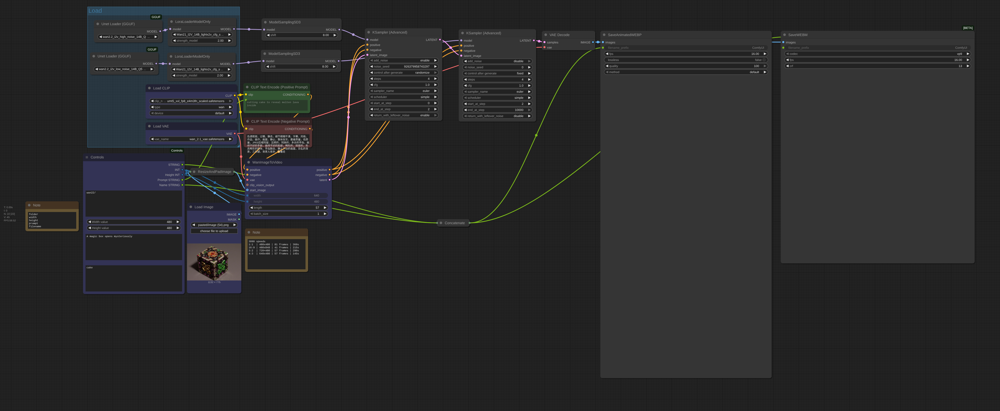
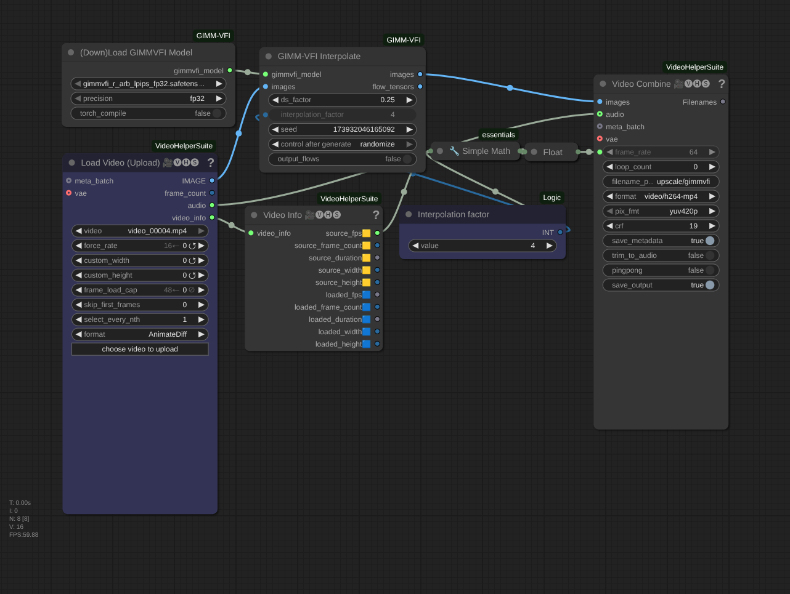
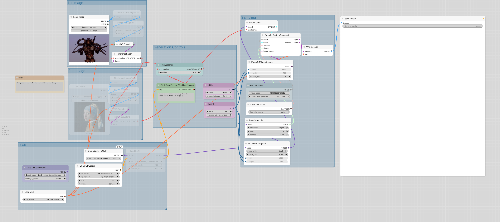
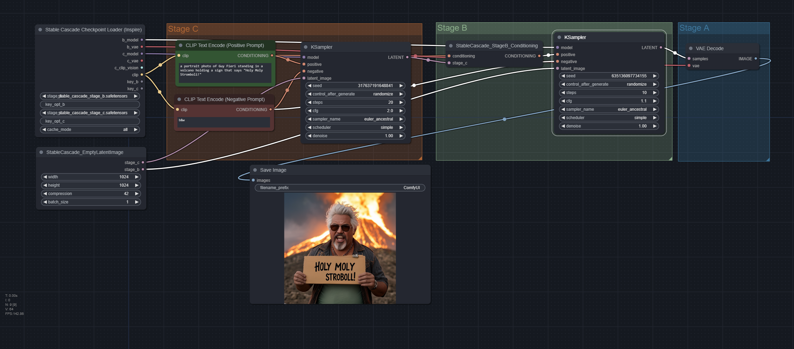
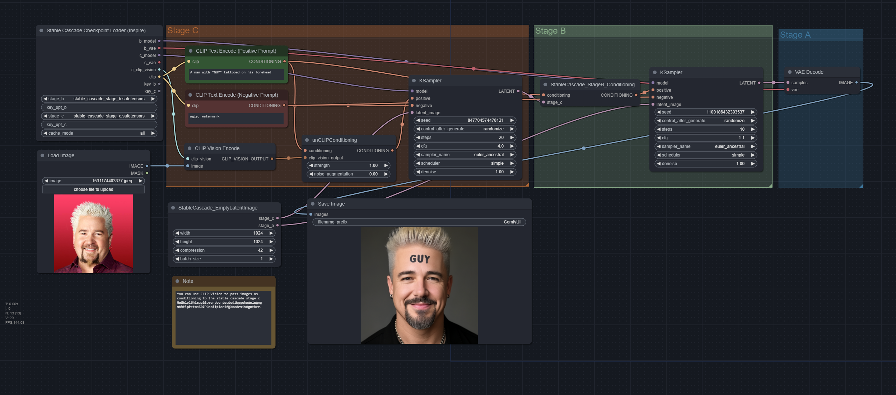
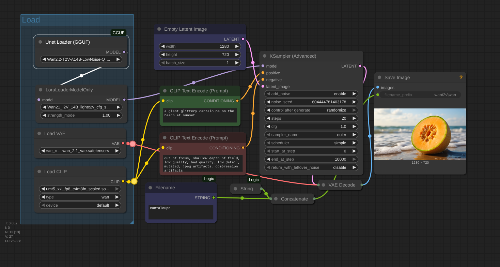
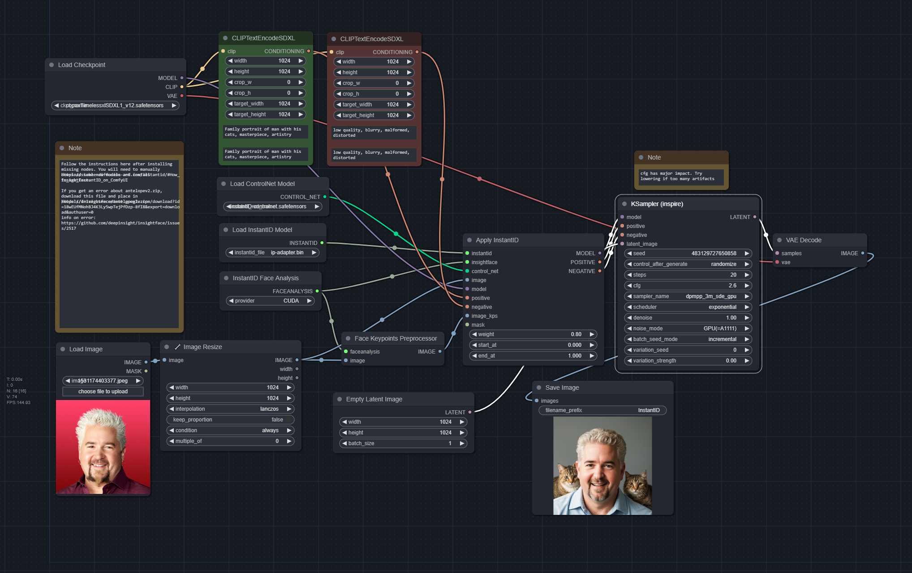

If you find these helpful, consider buying me a coffee:
https://buymeacoffee.com/reticulated

## Updates
**8/2/2025**
Basic WAN 2.2 txt2img workflow
**8/1/2025**
Added Video workflows for wan 2.2, upscale, and interpolation
**6/30/2025**
Added Flux Kontext Ultimate Workflow.
**1/5/2025**
Added F5 TTS Workflows. See here: https://youtu.be/SbRAPKAvl_U

## About

This is meant to be a good foundation to start using ComfyUI in a basic way. Should be familiar to those coming from A1111. 

You can import the json files or the pngs into Comfy to use the workflows. Most workflows are built for SDXL by default but can be changed easily to work with other SD versions.

## Video
### Wan 2.2 GGUF + lightx2v

### Interpolate GIMM-VFI

### Video Upscale

## Flux Workflows
### Flux Kontext Ultimate Workflow

### Flux with LORA

### Flux LORA LLM Autoprompt

### Miaoshouai-Tagger/Captions

### Flux LORA Train

### Flux LORA Test

### Flux LORA Character Sheet Maker

## Stable_Cascade Workflows
### txt2img_stablecascade

### img2img_stablecascade

### imgprompt_stablecascade

## LLM_Llava Workflows
### LLava Batch File

### LLava File Namer

## Basic Workflows
### WAN2.2 txt2img

### txt2img

### txt2img LORA

### img2img

### img2img LORA

### controlnet

### Controlnet Multi (2 controlnet models)

### Controlnet + T2I Toolkit

### IPAdapter

### IPAdapter + Controlnet

### T2I Adapter

### Inpainting

### Outpainting

### Hires Fix

### Instant ID

### Face Detailer

### Prompts from File

### XYZ Plot (for sampler config; use prompts from file for batch prompts)

### Upscale SUPIR

### InstructPix2Pix

### Image Merge SDXL Unclip

### Image Merge Unclip

