This is meant to be a good foundation to start using ComfyUI in a basic way. Should be familiar to those coming from A1111. 

You can import the json files or the pngs into Comfy to use the workflows. Most workflows are built for SDXL by default but can be changed easily to work with other SD versions.

## Workflows
 - txt2img
 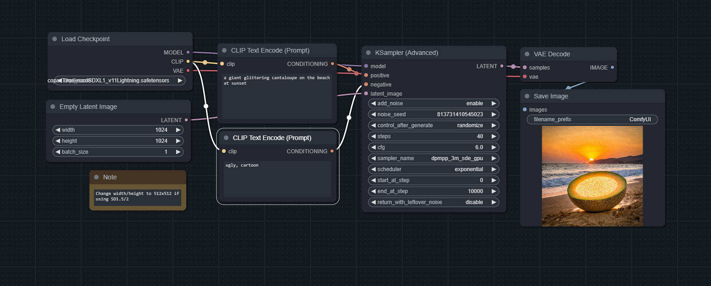
 - txt2imglora
 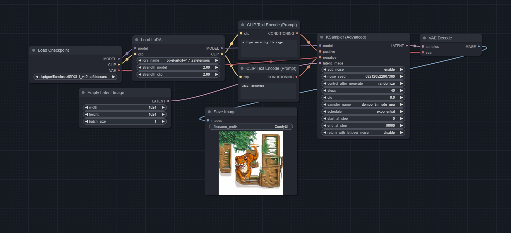
 - img2img
 
 - img2imglora
 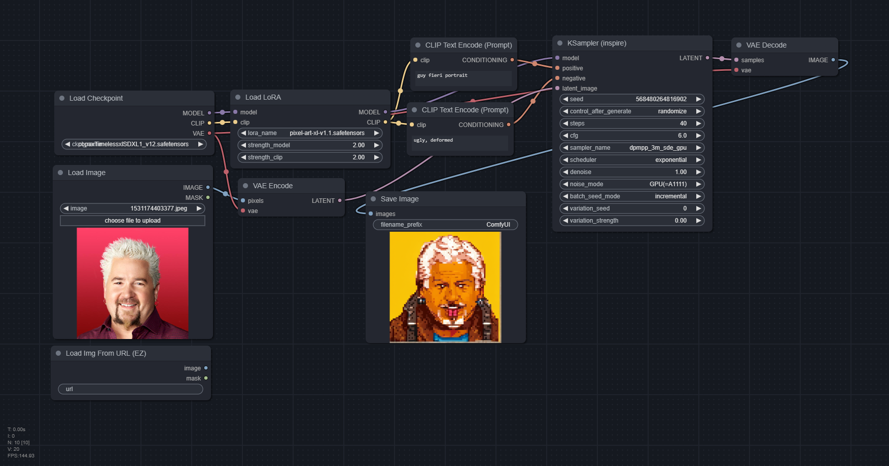
 - controlnet
 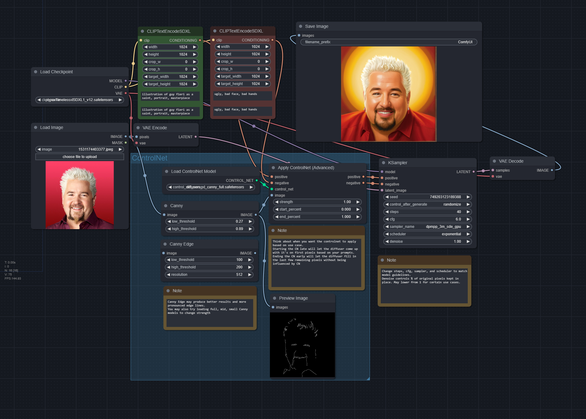
 - contolnet-multi (2 controlnet models)
 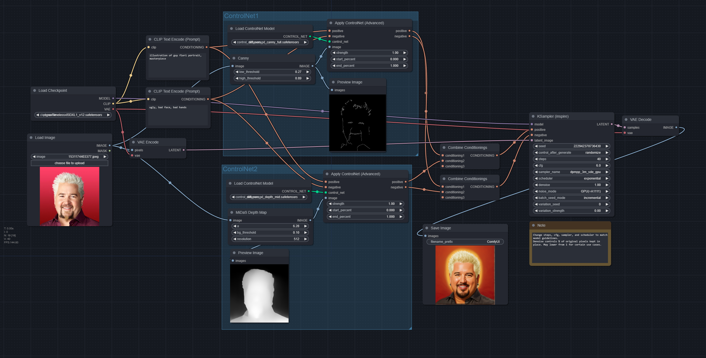
 - IPAdapter
 
 - IPAdapter+controlnet
 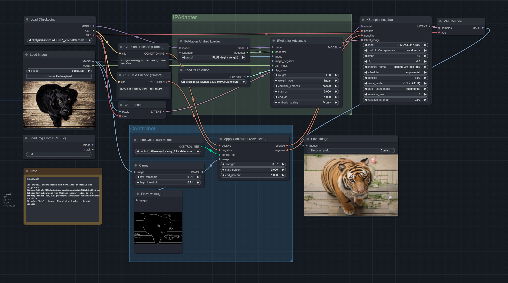
 - inpainting
 
 - outpainting
 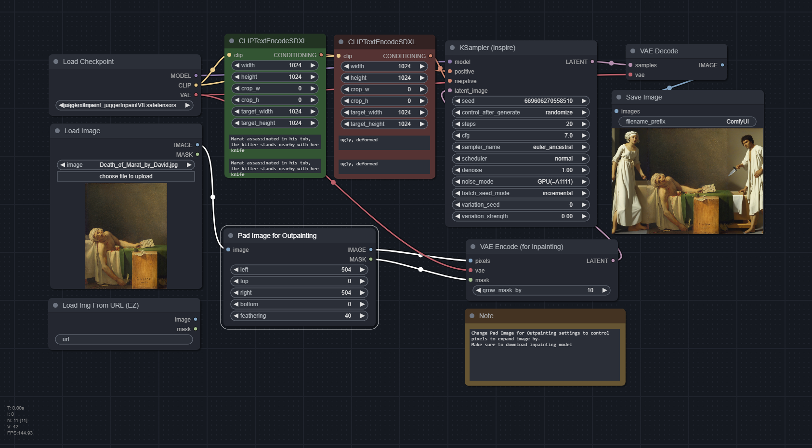
 - hiresfix
 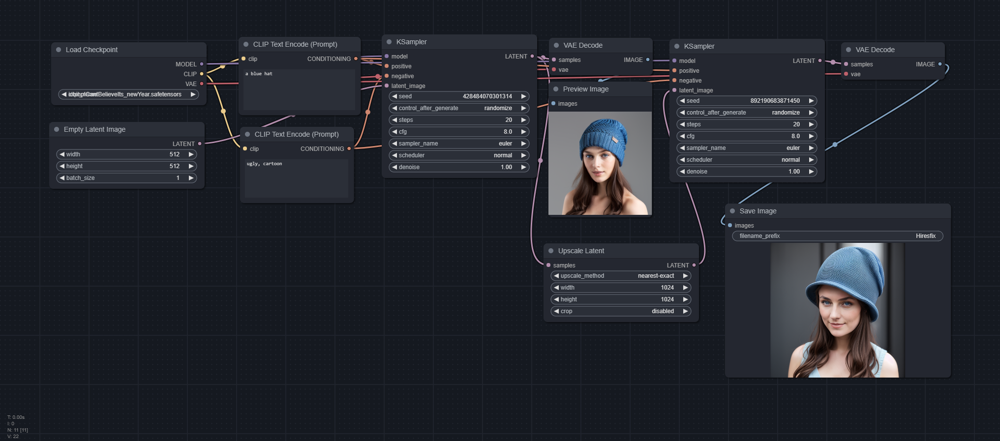
 - InstantID
 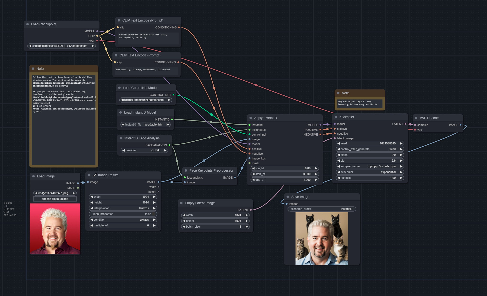
 - Facedetailer
 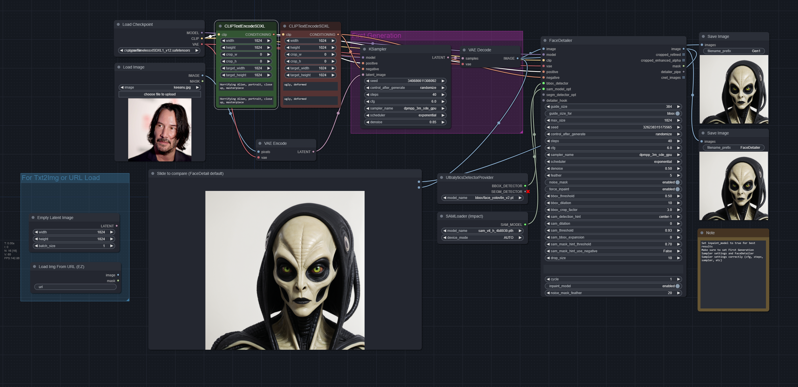
 - promptsfromfile
 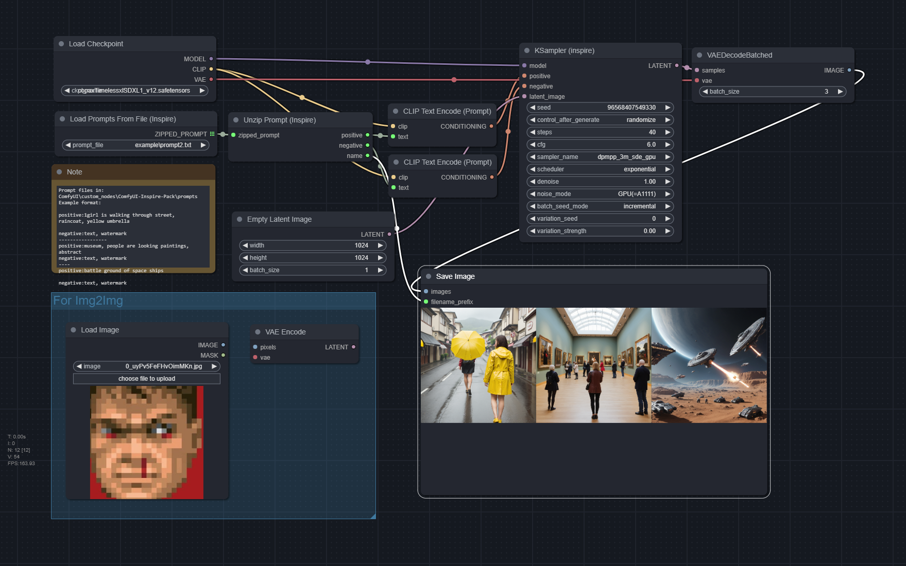
 - xyzplot (for sampler config. Use prompts from file for batch prompts)
 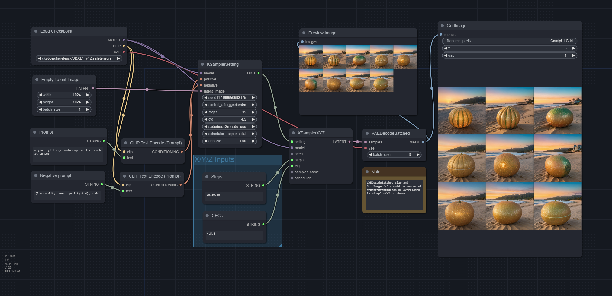
 - upscaleSUPIR
 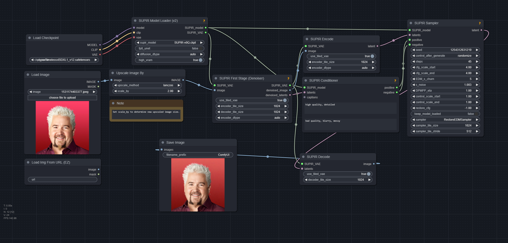
 - InstructPix2Pix
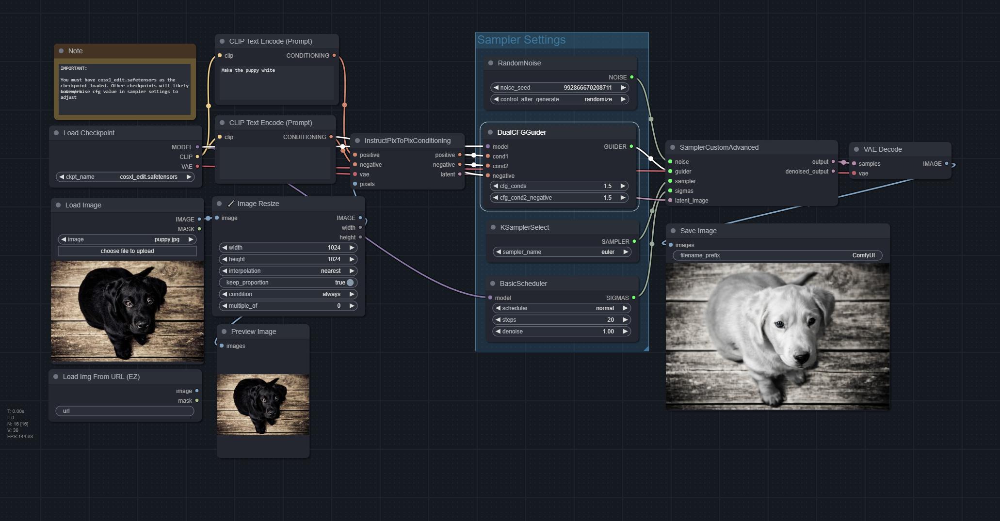