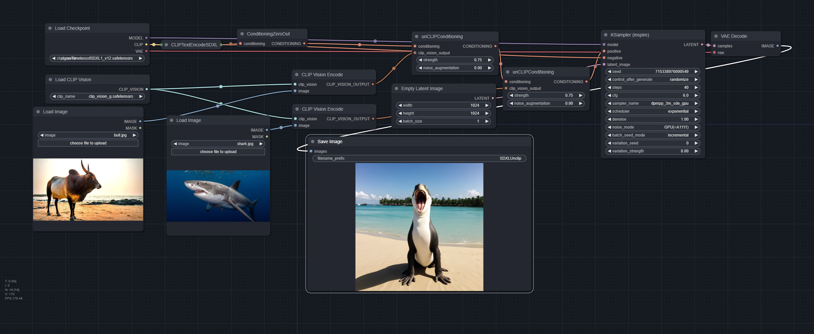

## Updates

**1/4/24**
Addded audio generation workflows, Added cogvideox workflows, reorganized all workflows. Improved Flux lora training and testing workflows.

**10/26/24**
Added Workflows for Flux w/ LORA, Flux LORA Autoprompt and Flux LORA Training

**6/8/24**
2 new Llava workflows to 1-at-a-time-batch engage with clip vision images to ask questions or rename images.

**5/24/24**
Cleaned up all workflows, added notes, improved IPA and outpaint workflows, changed clip to SDXLclip

New workflows: StableCascade txt2img img2img and imageprompt, InstantID, Instructpix2pix, controlnetmulti, imagemerge_sdxl_unclip, imagemerge_unclip, t2iadapter, controlnet+t2i_toolkit 

## About

This is meant to be a good foundation to start using ComfyUI in a basic way. Should be familiar to those coming from A1111. 

You can import the json files or the pngs into Comfy to use the workflows. Most workflows are built for SDXL by default but can be changed easily to work with other SD versions.

## Flux Workflows
### Flux with LORA

### Flux LORA LLM Autoprompt

### Flux LORA Train

### Flux LORA Test

## Stable_Cascade Workflows
### txt2img_stablecascade

### img2img_stablecascade

### imgprompt_stablecascade

## LLM_Llava Workflows
### LLava Batch File

### LLava File Namer

## Basic Workflows
### txt2img

### txt2img LORA

### img2img

### img2img LORA

### controlnet

### Controlnet Multi (2 controlnet models)

### Controlnet + T2I Toolkit

### IPAdapter

### IPAdapter + Controlnet

### T2I Adapter

### Inpainting

### Outpainting

### Hires Fix

### Instant ID

### Face Detailer

### Prompts from File

### XYZ Plot (for sampler config; use prompts from file for batch prompts)

### Upscale SUPIR

### InstructPix2Pix

### Image Merge SDXL Unclip

### Image Merge Unclip

